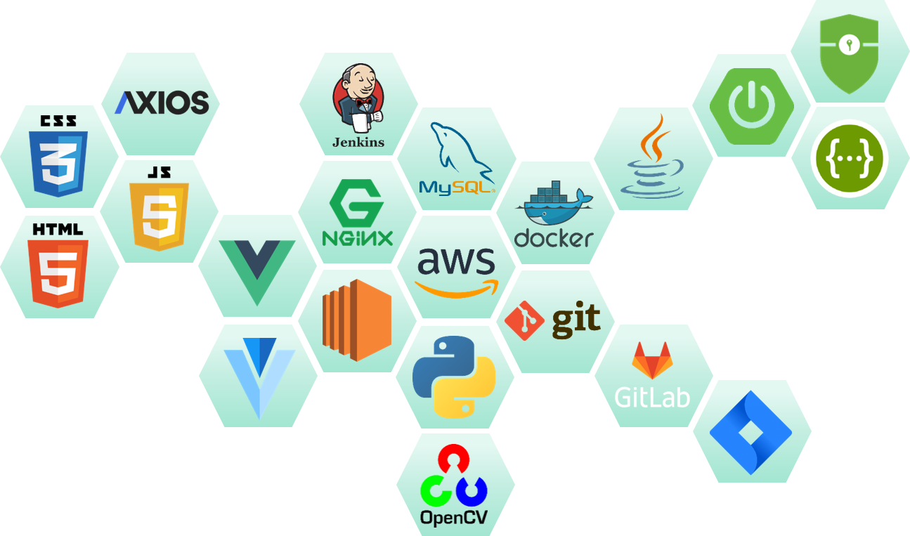
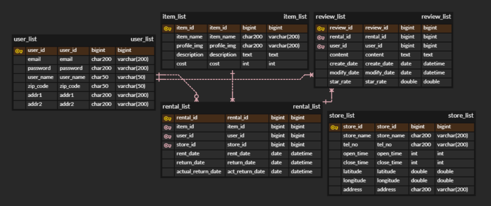
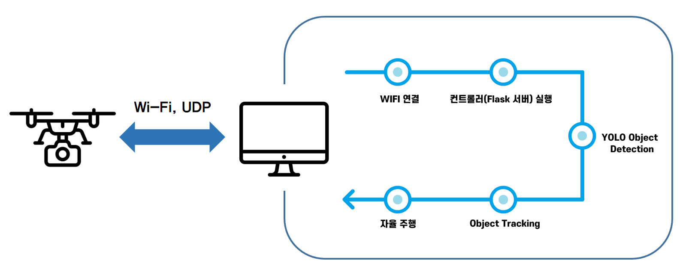
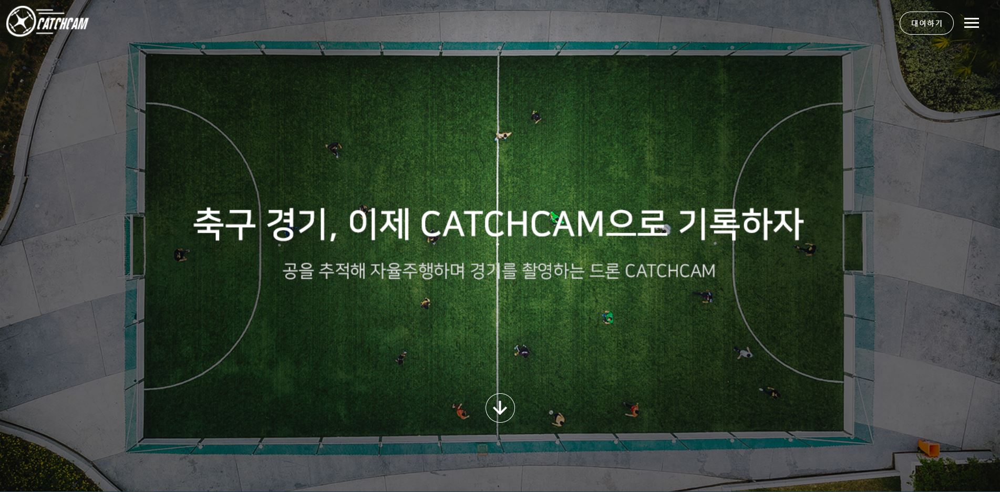

[](https://catchcam.site)

     

<br>

### 번역: [KR](#) [US](./docs)

<br>

# :small_airplane: CatchCam (Catch me if you Cam)

**`CatchCam`은 Object tracking을 활용한 자율주행 촬영 드론 서비스입니다.**

* 경기하는 내 모습을 간직하고 싶을 때
* 경기 분석이 필요할 때
* 경기를 녹화해 줄 인력이 부족할 때
* 경기 도중 심판의 판정이 애매할 때

위 요구사항을 만족시키기 위해 CatchCam을 기획하였습니다.

기존 촬영용 드론은 직접 조작을 하며 촬영을 진행해야 하고, 조작이 어려워 숙련된 인력이 필요합니다. 

그래서 **CatchCam**은 OpenCV를 활용한 Object tracking을 통해 자율 주행하며 촬영하는 서비스를 제공합니다.
드론으로 경기를 촬영하면 지상에서 촬영하는 것과는 달리 공중에서 촬영하기 때문에 다양한 각도에서 선수들의 위치를 확인하며 색다른 촬영물을 만들 수 있습니다. 

<br>

<br>

## 📌 목차 

- [사용된 기술](#-사용된-기술)
- [프로젝트 구조](#-프로젝트-구조)
- [ERD](#-erd)
- [프로젝트 프로세스](#-프로젝트-프로세스)
- [주요 기능](#-주요-기능)
- [시연 영상](#-시연-영상)
- [지원하는 브라우저](#-지원하는-브라우저)
- [개발자](#-개발자)

<br>

<br>

## 🔨 사용된 기술



<br>

<br>

## 🧱 프로젝트 구조

```
.
├─ README.md
│
├─backend # 백엔드 Spring boot Framework
│  ├─ .gitignore # Git 버전 관리에서 제외할 파일 목록을 지정하는 파일
│  ├─ build.gradle # 의존성 주입
│  ├─ gradlew
│  ├─ gradlew.bat
│  ├─ settings.gradle
│  │
│  ├─gradle
│  │  └─wrapper # gradle-wrapper 관련
│  │
│  └─src
│      ├─main
│      │  ├─java
│      │  │  └─com
│      │  │      └─ssafy
│      │  │          └─catchcam
│      │  │              ├─CatchcamApplication.java # 스프링 부트 실행 파일
│      │  │              │
│      │  │              ├─config # SpringBoot 세팅 관련
│      │  │              │  │
│      │  │              │  └─security # Security 관련
│      │  │              │
│      │  │              ├─controller #Controller 관련
│      │  │              │
│      │  │              ├─model #DTO 관련
│      │  │              │
│      │  │              ├─repository #DAO 관련
│      │  │              │
│      │  │              └─service #Service 관련
│      │  │
│      │  └─resources
│      │      └─mappers # 각 DAO와 연결될 SQL 쿼리 폴더
│      │
│      └─test # 테스트 관련 파일
│
├─drone
│  │  config.py  # Flask 서버 설정 파일
│  │  main.py  # 드론 컨트롤러 구동 파일
│  │  README.md
│  │  requirements.txt  # 필요한 패키지 목록
│  │
│  └─droneapp
│      │
│      ├─controllers
│      │      server.py  # 웹페이지 API
│      │
│      ├─models
│      │      drone_manager.py  # 드론 조작 API
│      │
│      ├─static
│      │  ├─css # css 관련
│      │  │
│      │  ├─img  # 웹페이지 이미지
│      │  │
│      │  └─js # jquery 라이브러리
│      │
│      └─templates # 화면
│
│
└─frontend # 프론트엔드 Vue.js 프레임워크
    ├─ ... # vue 관련 빌드 관련 폴더 및 파일
    ├─package.json # 라이브러리 관련 파일
    │
    ├─public # 외부에서 접근 가능한 폴더
    │
    └─src
        ├─App.vue
        ├─main.js
        │
        ├─api
        │
        ├─assets # 로고 및 이미지 관련
        │
        ├─components # 헤더 및 푸터
        │  │
        │  ├─droneintro # 드론 소개 페이지
        │  │
        │  └─rentallist # 나의 대여 목록
        │
        ├─plugins # Vuetify 라이브러리 관련 디렉토리
        │
        ├─router # 라우팅(경로) 세팅
        │
        ├─store # Vuex에서 사용하는 공유 데이터 관리
        │
        └─views # 메인 화면
            │
            └─member # 회원가입 및 로그인 화면
    	
```

<br>

<br>

## 📃 ERD



<br>

<br>

## 🔍 프로젝트 프로세스

- 웹


- 드론



<br>

<br>

## ✅ 주요 기능

- **드론 대여**
  - 지도를 통한 지점 위치 확인
  - 대여 날짜 입력 후 대여 신청
#   

- **드론 대여 내역**
  
  - 대여 목록과 완료된 대여 내역 조회
  - 예약 취소
#   

- **컨트롤러를 이용한 드론 조작**
  
  - 상 하 좌 우 및 회전 등의 간단한 조작 가능
  - 화면 왼쪽에서 드론의 카메라로 찍히는 장면을 실시간으로 송출
# 

- **객체 추적 자율주행 촬영**
  
  - 공을 객체로 인식
#   
  - 사람을 객체로 인식    
# 

- **화면 녹화 기능**
  
  - 드론에서 촬영한 영상을 파일로 저장
# 

<br>

<br>

## 🎥 시연 영상

> 아래 이미지를 클릭하면 시연 영상을 시청할 수 있습니다.

[](https://youtu.be/MJfI8611Jq8)

<br>

<br>

## 🌏 지원하는 브라우저

|  |  |  |  |
| :----------------------------------------------------------: | :----------------------------------------------------------: | :----------------------------------------------------------: | :----------------------------------------------------------: |
|                            latest                            |                            latest                            |                            latest                            |                            latest                            |

<br>

<br>

## 👩‍💻 개발자

- 서용준 (https://github.com/YongjoonSeo)
- 허예슬 (https://github.com/yeseul4072)
- 이승진 (https://github.com/lsjboy93)
- 이근우 (https://github.com/lkwoo)
- 강슬기 (https://github.com/cocony12)

<br>