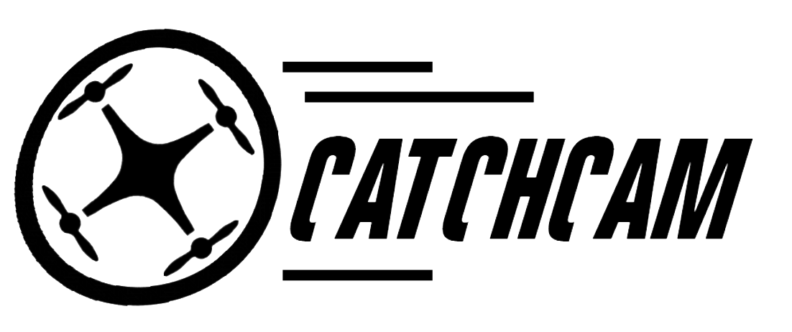
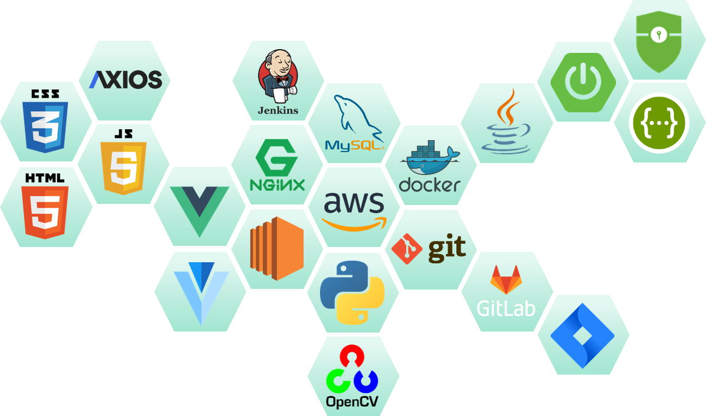
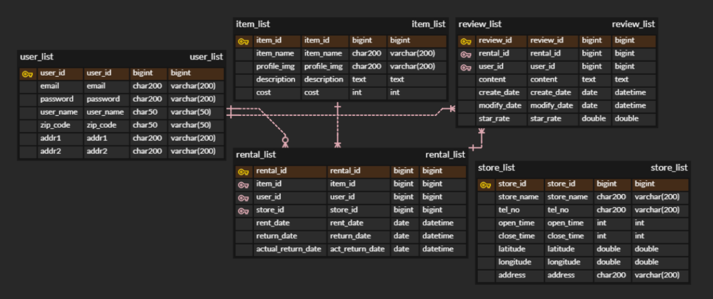
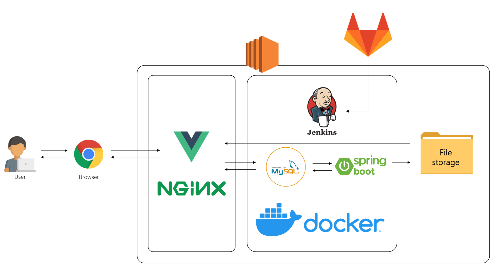
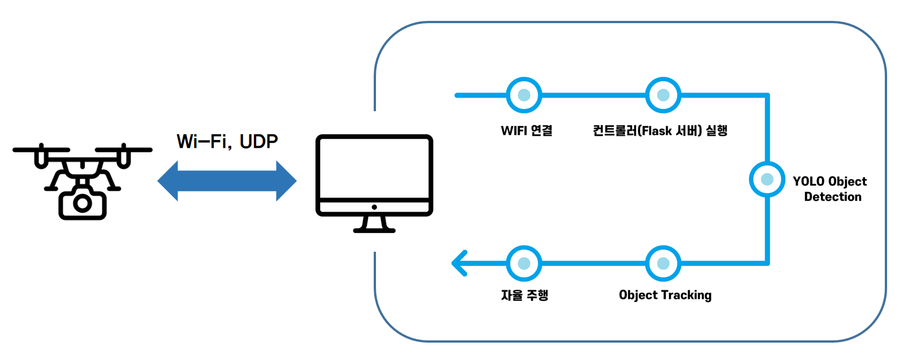
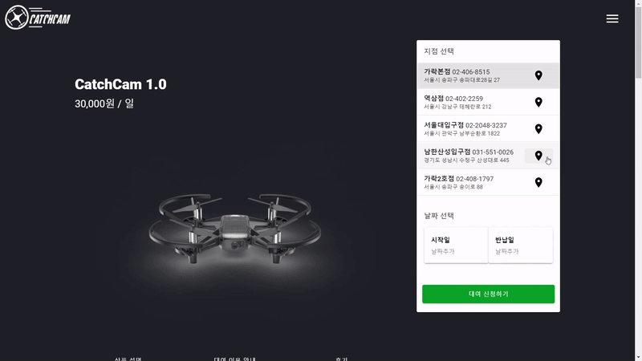
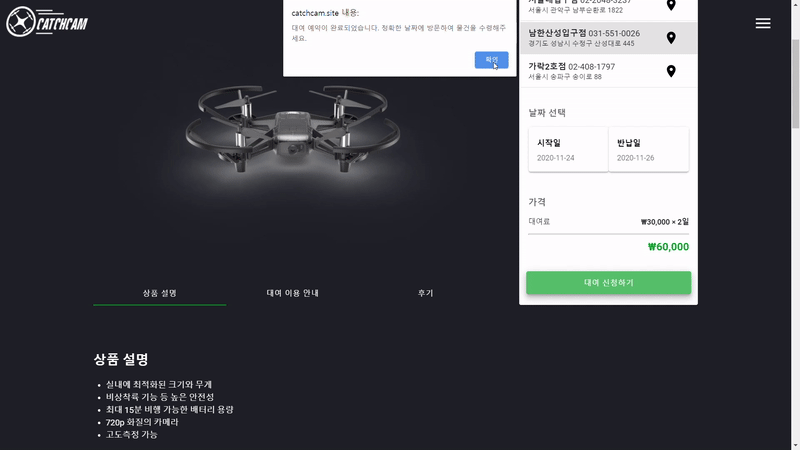
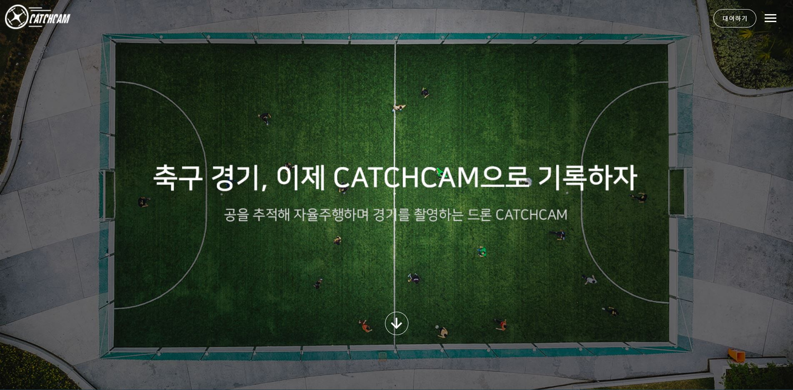

[](https://catchcam.site)

     

<br>

### Translation: [US](#) [KR](https://lab.ssafy.com/s03-final/s03p31a102)

<br>

# :small_airplane: CatchCam (Catch me if you Cam)

**`CatchCam` is an autonomous shooting drone service using object tracking.**

* When I want to record a video of myself playing
* When you need to analyze the game
* When there is not enough manpower to record the game
* When the judge's decision is ambiguous during a game

CatchCam is designed to satisfy the above requirements.

Existing drones for shooting require direct manipulation and shooting, and are difficult to operate, requiring skilled personnel.

Therefore, **CatchCam** provides a service for autonomous driving and shooting through object tracking using OpenCV. When shooting a game with a drone, unlike shooting from the ground, you are shooting from the air, so you can check the position of the players from various angles and create a different film. 

<br>

<br>

## 📌 Table of Contents

- [Tech Stacks](#-Tech-Stacks)
- [Project Structure](#-Project-Structure)
- [ERD](#-ERD)
- [Project Process](#-Project-Process)
- [Main Function](#-Main-Function)
- [Demonstration](#-Demonstration)
- [Browsers Supported](#-Browsers-Supported)
- [Developers](#-Developers)

<br>

<br>

## 🔨 Tech Stacks



<br>

<br>

## 🧱 Project Structure

```
.
├─ README.md
│
├─backend # Backend Spring boot Framework
│  ├─ .gitignore # List of files to exclude from Git versioning
│  ├─ build.gradle # Dependency injection
│  ├─ gradlew
│  ├─ gradlew.bat
│  ├─ settings.gradle
│  │
│  ├─gradle
│  │  └─wrapper # gradle-wrapper
│  │
│  └─src
│      ├─main
│      │  ├─java
│      │  │  └─com
│      │  │      └─ssafy
│      │  │          └─catchcam
│      │  │              ├─CatchcamApplication.java # SpringBoot Executable file
│      │  │              │
│      │  │              ├─config # SpringBoot configuration file
│      │  │              │  │
│      │  │              │  └─security # SpringBoot Security file
│      │  │              │
│      │  │              ├─controller # SpringBoot Controller file
│      │  │              │
│      │  │              ├─model # Spring Boot DTO file
│      │  │              │
│      │  │              ├─repository #Spring Boot DAO file
│      │  │              │
│      │  │              └─service #Spring Boot service file
│      │  │
│      │  └─resources
│      │      └─mappers # SQL query folder to be associated with each DAO
│      │
│      └─test # Test related files
│
├─drone
│  │  config.py  # Flask server configuration file
│  │  main.py  # Drone controller drive file
│  │  README.md
│  │  requirements.txt  # List of required packages
│  │
│  └─droneapp
│      │
│      ├─controllers
│      │      server.py  # Webpage API
│      │
│      ├─models
│      │      drone_manager.py  # Drone operation API
│      │
│      ├─static
│      │  ├─css # css file collection
│      │  │
│      │  ├─img  # Image to use in web page
│      │  │
│      │  └─js # jquery library
│      │
│      └─templates 
│
│
└─frontend # Frontend Vue.js framework
    ├─ ... # Build-related folder
    ├─package.json # dependency management file
    │
    ├─public # Externally accessible folder
    │
    └─src
        ├─App.vue
        ├─main.js
        │
        ├─api
        │
        ├─assets # Folder for collection of used images
        │
        ├─components 
        │  │
        │  ├─droneintro # Components related to the drone rental page
        │  │
        │  └─rentallist # Components related to rental history
        │
        ├─plugins # Vuetify's library related directory
        │
        ├─router # Routing settings file
        │
        ├─store # Shared data management used by Vuex
        │
        └─views # Routing component collection
            │
            └─member # Member registration and login component
```

<br>

<br>

## 📃 ERD



<br>

<br>

## 🔍 Project Process

- Web



- Drone



<br>

<br>

## ✅ Main Function

- **Drone rental**
  
  - Check the location of the branch through the map
  - Apply for rental after entering the rental date
#   

- **Drone rental history**
  - View rental list and details
  - Reservation cancellation function
#   

- **Drone operation using a controller**
  
  - Simple operation such as up, down, left, right and rotation is possible
  - On the left side of the screen, the scene captured by the drone's camera is transmitted in real time
# 

- **Object tracking autonomous driving shooting**
1. Recognize the ball as an object
#   
2. Recognize the person as an object    
# 

- **Screen recording function**
  
  - Save the video captured by the drone as a file
# 

<br>

<br>

## 🎥 Demonstration

> Click the image below to watch the demo video.

[](https://youtu.be/MJfI8611Jq8)

<br>

<br>

## 🌏 Browsers Supported

|  |  |  |  |
| :----------------------------------------------------------: | :----------------------------------------------------------: | :----------------------------------------------------------: | :----------------------------------------------------------: |
|                            latest                            |                            latest                            |                            latest                            |                            latest                            |

<br>

<br>

## 👩‍💻 Developers

- Yongjoon Seo (https://github.com/YongjoonSeo)
- Yeseul Heo (https://github.com/yeseul4072)
- SeungJin Lee (https://github.com/lsjboy93)
- Keunwoo Lee (https://github.com/lkwoo)
- Seulki Kang (https://github.com/cocony12)


<br>